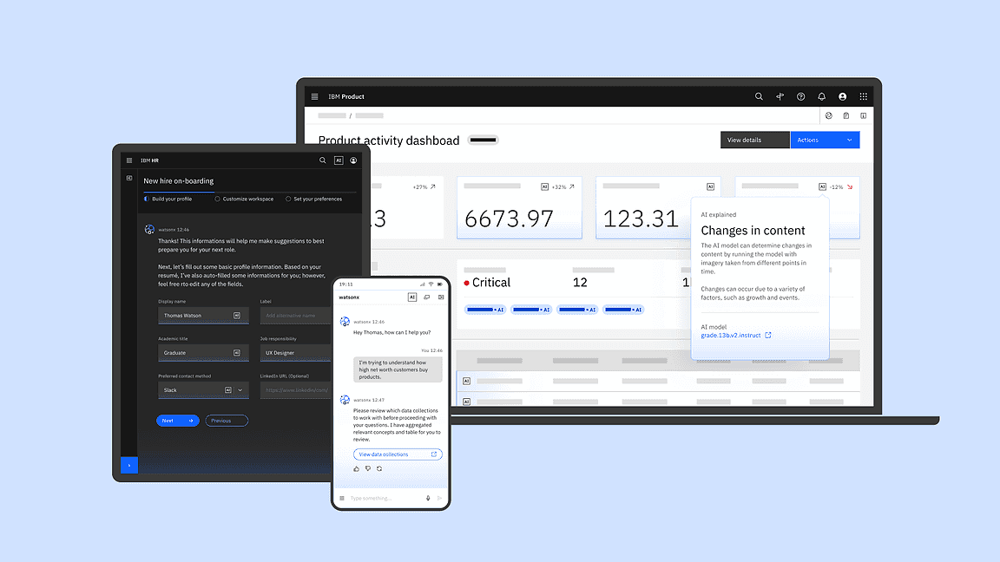

.. CarbonKivy documentation master file, created by
   sphinx-quickstart on Thu Mar 13 13:05:51 2025.
   You can adapt this file completely to your liking, but it should at least
   contain the root `toctree` directive.

CarbonKivy - Carbon Design Kivy
=================================================

.. rst-class:: lead

   A Library providing IBM's Carbon Design Components for `Kivy <https://kivy.org>`_.

CarbonKivy is a Python library that integrates IBM's `Carbon Design System <https://www.carbondesignsystem.com/>`_ with the Kivy framework. It provides a modern, accessible, and user-friendly UI toolkit inspired by Carbon’s design principles, enabling developers to create consistent and visually appealing applications in Kivy.

.. toctree::
   :hidden:

   Welcome <self>

.. toctree::
   :hidden:

   carbondesignsystem
   contributing

